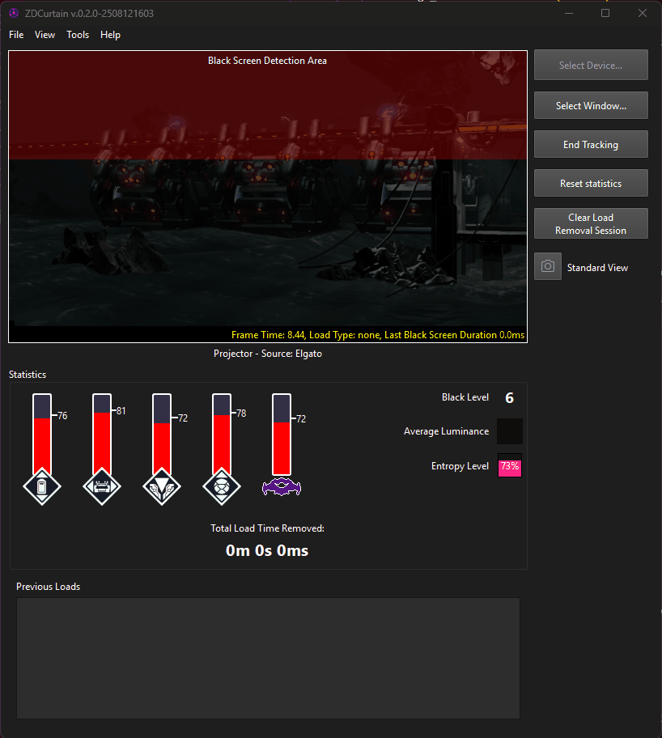

# ZDCurtain Load Remover

Remove load times from your copy of Metroid Dread for Nintendo Switch! 

## Major features

ZDCurtain works across all environments:

- Use any version of the game!
- Play on Nintendo Switch 1 or Nintendo Switch 2!
- Works on Nintendo Switch insertable Game Cards, internal digital storage, and microSD / microSD Express Cards!
- Compatible with any timer that allows pausing and resuming using the keyboard
- Export your load data to readable file formats (JSON, CSV, and Excel) for data storage and research purposes
- Use without a timer to get a Loads Removed Time from an established Real Time Attack (RTA) Metroid Dread Speedrun

## How does it work?

ZDCurtain works by comparing a screen capture of the game to common comparison images used in Metroid Dread's load screens. If ZDCurtain is confident that what it's seeing is a load screen, it will pause your game timer of choice until the load is complete while accounting for when the load started. It also removes black screen load times by comparing the a slice of the top of the game feed to solid black and pausing your game timer until the feed is no longer solid black. 

ZDCurtain eliminates:

- Area transition load times (elevator, tram / train, teleportal, Itorash capsule)
- Black screen load times caused by moving from one room to another, as long as the black screen exists for at least 100 milliseconds
- Load times that occur during hint screens (for example, when first loading the game or when reloading after returning to a checkpoint or save point)
- The load time between the Raven Beak fight and the Raven Beak X cutscene
- All of the above loads when they occur while playing Metroid Dread Randomizer, as well as "Itorash Big Load"

## Known Issues

- For now, ZDCurtain only supports "Default Brightness" (the middle of the brightness slider) on a Switch where the RGB Range is set to "Limited". Full color range support will be added in a future release. Ensure that your color range in your video capture program (OBS, etc.) matches the RGB Range on your Nintendo Switch console for best results.
- ZDCurtain does not support streams where stream layouts or alerts obscure the game feed view. In addition, it does not support captures where the game console is being filmed with a camera. This will potentially be addressed in a future release.

## Known Limitations

- __**You must provide a clean, uncropped game feed to ZDCurtain in order for it to work.**__ This means no stream layouts or alerts can obscure the view that ZDCurtain has to the game feed. To launch a clean game feed in OBS, either set your OBS Virtual Camera to the output of your capture card, or right-click your capture card source and click "Open Source Projector", then click "New window". **Resize your projector window so that it is *at least* 640x360 in resolution.**
- The window that you are capturing from cannot be minimized.
- ZDCurtain is only capable of interacting with the "Real Time" timer in LiveSplit, which means you cannot have a Real-Time Attack (RTA) time and a Loads Removed Time (LRT) at the same time. This will be addressed in a future release.
- ZDCurtain must be able to rapidly pause and resume the timer in order to remove black screen load times. For this reason, ZDCurtain is incompatible with the "Double-Tap Prevention" option in LiveSplit.
- Custom regions cannot be selected at this time.

# Installation

Download the latest version from the [Releases page](https://github.com/goth-uhaul/ZDCurtain/releases/latest). Unzip the file and double-click to run.

## Compatibility

ZDCurtain is compatible with Windows 10 and 11.

# Credits

- Created by [jay](https://bsky.app/profile/jayena.hijumpboots.com) using code and concepts from [AutoSplit](https://github.com/Toufool/AutoSplit)
- [may_berry](https://bsky.app/profile/mayberryzoom.bsky.social) for the app icon, Dread system knowledge, and LiveSplit usage knowledge
- [Arcanox](https://bsky.app/profile/arcanox.me) for the confidence plateau algorithm advice
- [Vale](https://bsky.app/profile/valefor-m.bsky.social) for creating masks and for testing support
- [Hobbit](https://bsky.app/profile/hobbit1697.bsky.social) for testing support
- [Manijure](https://bsky.app/profile/manijure.hijumpboots.com) for testing support
