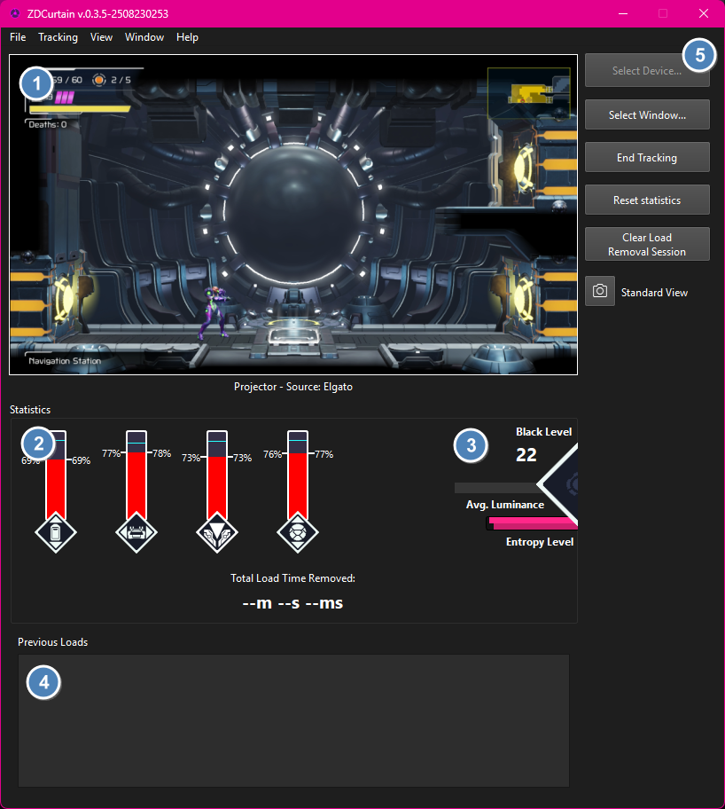

# ZDCurtain Load Remover

Remove load times from your copy of Metroid Dread for Nintendo Switch! 

## Major features

ZDCurtain works across all environments:

- Use any version of the game!
- Play on Nintendo Switch 1 or Nintendo Switch 2!
- Works on Nintendo Switch insertable Game Cards, internal digital storage, and microSD / microSD Express Cards!
- Export your load data to readable file formats (JSON, CSV, and Excel) for data storage, verification, and research purposes

## How does it work?

ZDCurtain works by comparing a screen capture of the game to common comparison images used in Metroid Dread's load screens. If ZDCurtain is confident that what it's seeing is a load screen, it will count up the amount of time that should be removed until the load is complete, while also accounting for when the load started. It also removes black screen load times by comparing the a slice of the top of the game feed to solid black and pausing your game timer until the feed is no longer solid black. At the end of the run, you will have a time value that is the sum of all loads removed from the run; you can then subtract this from your Real-Time Attack (RTA) time in order to get your Loads Removed Time (LRT).

ZDCurtain eliminates:

- Area transition load times (elevator, tram / train, teleportal, Itorash capsule)
- Black screen load times caused by moving from one room to another, as long as the black screen exists for at least 100 milliseconds (Metroid Dread's delta time cap)
- Load times that occur during hint screens (for example, when first loading the game or when reloading after returning to a checkpoint or save point)
- The load time between the Raven Beak fight and the Raven Beak X cutscene
- All of the above loads when they occur while playing Metroid Dread Randomizer, as well as "Itorash Big Load"

# Installation

Download the latest version from the [Releases page](https://github.com/goth-uhaul/ZDCurtain/releases/latest). Unzip the file and double-click to run.

# Using ZDCurtain

## Before Your First Session

Before your first session, you should make sure that you have double-checked the following:

- Your Nintendo Switch should be set to *limited RGB color range*. To change this setting, go to Settings > TV Settings > RGB Range, and set this value to "Limited".
- Your copy of Metroid Dread should be set to "default" brightness. To change this, press "-", select "Adjust Brightness", and make sure the slider is in the middle.
- Your game feed should be clean, uncropped, and unobscured by stream layouts or alerts. The easiest way to accomplish this in OBS is by either setting your OBS Virtual Camera to the output of your capture card, or right-clicking your capture card source and click "Open Source Projector", then clicking "New window". Your projector window should be at least 640x360 in resolution. After you have resized the projector, right-click the projector window, and select "Fit window to content".

## Familiarizing Yourself with the Program

Upon loading ZDCurtain, you will be presented with the main capture analysis dashboard.

1. Capture Analysis Window: this is ZDCurtain's main capture feed. It should update in real-time based on your capture card.
2. Similarity Bars: these bars provide real-time information on how similar the Capture Analysis Window is to each type of load screen. The bars presented are, in order: elevator loads, tram / train loads, teleportal loads, and Itorash capsule loads. Each bar displays the current and max similarity values for that session, as well as the threshold needed to detect a load. When the threshold is crossed, the border of the icon for that bar will turn yellow. When a load is confirmed, the icon for that bar will switch to a golden "loading" icon.
3. Image Analysis Indicators: these indicators provide information on how dark the Capture Analysis Window is, as well as how uniform the color is. The icon on the right is the indicator for black screen and "spinner" loads. When either of these load types are confirmed, this icon will switch to a golden "loading" icon.
4. Previous Loads: a list of all loads that have been detected, most recent load first.
5. Quick Actions: this sidebar allows you to take screenshots, control tracking, and clear your session data.

### Similarity Bar

1. The type of load the bar represents.
2. The current similarity value.
3. The maximum similarity value for that session.
4. The threshold needed to detect a load (from Settings).

### Image Analysis Indicators

1. How dark the Capture Analysis Window currently is.
2. The average grayscale color of the Capture Analysis Window. The color of all pixels are averaged to determine this value.
3. The entropy, or color uniformity level of the Capture Analysis Window. The closer the screen is to a solid color, the lower these values are. The top bar is the "full" entropy, which represents the entire screen's color uniformity. The bottom bar is the "slice" entropy, which represents only the color uniformity of the area marked by the "Black Screen Detection Area" box in the Capture Analysis Window.
4. The loading icon. This turns from gray to gold during black screen loads and "spinner" loads.

## Your First Load Tracking Session

Select your projector by clicking "Select Window..." and clicking on where your projector window is on your desktop. This should result in the contents of your projector being visible in the Capture Analysis Window. When you are ready to begin tracking loads, click "Begin Tracking". ZDCurtain will start to analyze the contents of your game feed in real-time. **This can be processor-intensive!**

At this point, you can start playing the game. Watch the similarity bars and the image analysis indicators (black level, luminance, and entropy level) closely. You can follow a couple of rules in order to get your setup properly calibrated.

- When first capturing, put your Switch to sleep so that only a black screen is visible. In the frame info overlay, note the line "Minimum Entropy (full, slice)". Set your "Black Screen Entropy Threshold" slightly above both of these values.
- If black screens aren't being detected, increase the "Black Screen Threshold" in Settings. If that doesn't work, increase the "Black Screen Entropy Threshold".
- If dimly lit rooms are detecting false black screen loads, decrease the "Black Screen Entropy Threshold" to see if this eliminates the false positive. If it doesn't, decrease the "Black Screen Threshold" until the false positive is eliminated.
- If you are in a video load screen (either elevator, tram, teleportal, or Itorash capsule) and the maximum is less than your threshold for that type of load, lower your threshold to a couple of percentage points below the maximum that was detected.

Once your setup is properly calibrated, you should be good to go! At this point, you can open up the Stream Overlay and add it to your streaming layout. The Stream Overlay contains both the total Load Time Removed (LRT) throughout the session and loading indicators that you can display in your run to visually ensure that loads are being removed when watching the run later.

# Troubleshooting

## Known Issues

- Custom capture regions cannot be selected at this time.
- ZDCurtain does not interact with your existing timer (e.g. LiveSplit). Support for LiveSplit "Game Time" will be added in a future release.
- In testing, Windows Graphics Capture failed for some individuals. If you find that WGC does not work, use the OBS Virtual Camera.

## Known Limitations

- __**You must provide a clean, uncropped game feed to ZDCurtain in order for it to work.**__ This means no stream layouts or alerts can obscure the view that ZDCurtain has to the game feed. To launch a clean game feed in OBS, either set your OBS Virtual Camera to the output of your capture card, or right-click your capture card source and click "Open Source Projector", then click "New window". **Resize your projector window so that it is *at least* 640x360 in resolution,** right-click the projector window, and select "Fit window to content".
- The window that you are capturing from cannot be minimized.
- For now, ZDCurtain only supports "Default Brightness" (the middle of the brightness slider) on a Switch where the RGB Range is set to "Limited". Full color range support will be added in a future release. Ensure that your color range in your video capture stack (capture card, OBS, etc.) matches the RGB Range on your Nintendo Switch console for best results.
- ZDCurtain does not support streams where stream layouts or alerts obscure the game feed view. This will potentially be addressed in a future release.
- ZDCurtain does not support captures where the game console is being filmed with a camera. This will potentially be addressed in a future release.

## Compatibility

ZDCurtain is compatible with Windows 10 and 11.

# Credits

- Created by [jay](https://bsky.app/profile/jayena.hijumpboots.com) using code and concepts from [AutoSplit](https://github.com/Toufool/AutoSplit)
- [Mayberry](https://bsky.app/profile/mayberryzoom.bsky.social) for the app icon, Dread system knowledge, and LiveSplit usage knowledge
- [Arcanox](https://bsky.app/profile/arcanox.me) for the confidence plateau algorithm advice
- [Vale](https://bsky.app/profile/valefor-m.bsky.social) for creating masks and for testing support
- labmemb3r for testing support
- [Hobbit](https://bsky.app/profile/hobbit1697.bsky.social) for testing support
- [Manijure](https://bsky.app/profile/manijure.hijumpboots.com) for testing support
- Trisha for providing useful information on edge cases
